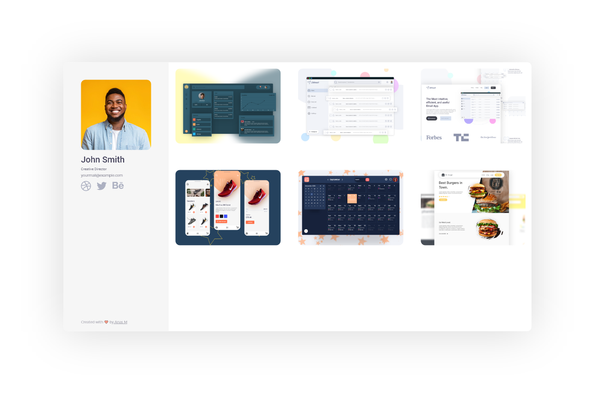

# Portfolio-Me

A project that contains 4 pages : 

- Main page ( portfolio ) 
- portfolio ( item ) 
- Posts List ( blog ) 
- Post page ( article ) 

## What's included?

- Adobe XD file 

## Preview

 

## Credits

- Bootstrap Grid v4.5.2 (https://getbootstrap.com/) Copyright 2011-2020 The Bootstrap Authors Copyright 2011-2020 Twitter, Inc. Licensed under MIT (https://github.com/twbs/bootstrap/blob/main/LICENSE) 

- Feather Icons (https://feathericons.com) Copyright (c) 2013-2017 Cole Bemis. Licensed under MIT (https://github.com/feathericons/feather/blob/master/LICENSE)

- Font Awesome free (https://fontawesome.com) © Fonticons, Inc. [License ](https://github.com/FortAwesome/Font-Awesome/blob/master/LICENSE.txt)

